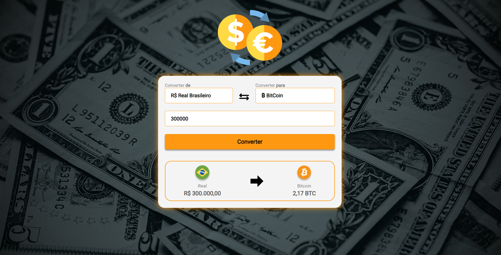

<h1 align="center">💰 Conversor | Moedas</h1>

Projeto de conversor de moedas utilizando JavaScript, a conversão pode ser realizada em 4 tipos de moeda que são:
  
<b>DÓLAR | EURO | LIBRA | BITCOIN</b>

A conversão de moeda inicial permite apenas o Real, em breve vou adicionar novas moedas e funcionalidades.

 
 

